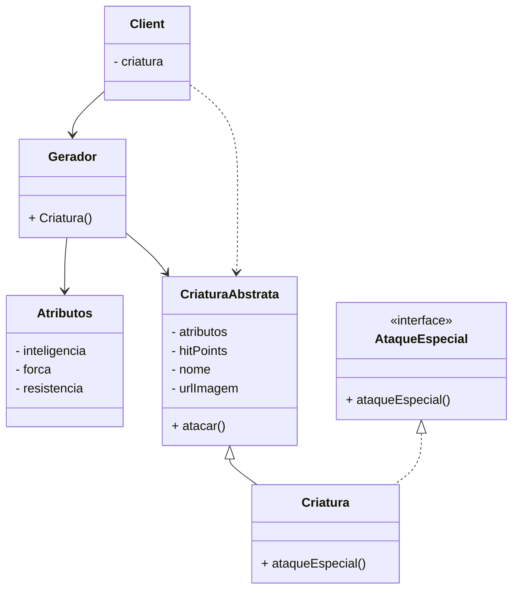

# CriatuMon SOLID Challenge

Para o Game CriatuMon você foi o desenvolvedor selecionado para criar o pacote de classes para o MVP do Game.

Basicamente cada criatura deverá ter os atributos nome, inteligencia, força, resistencia, hitPoints e um método para atacar.

Os hitPoints deverão seguir a seguinte regra:
```
    hitPoints = 5 * inteligencia
        + 3 * forca
        + 4 * resistencia
```

Cada criatura terá um método de ataque e também haverá a possibilidade de existir um ataque especial individual.



