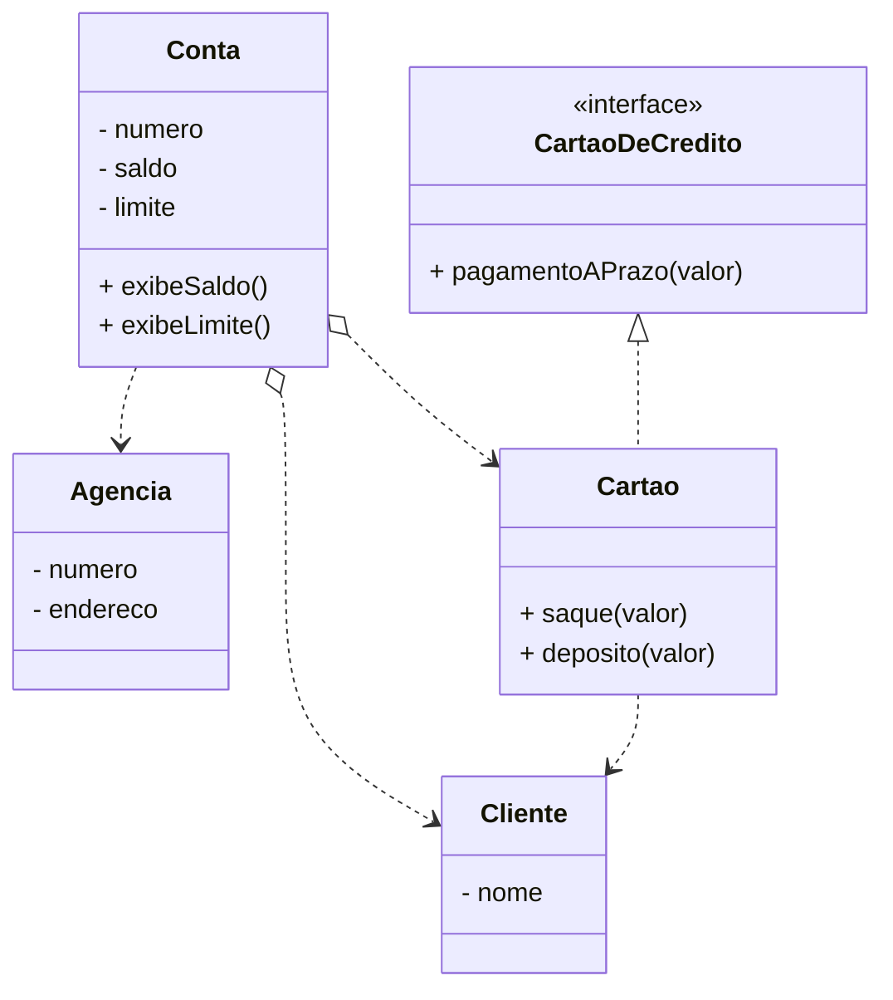

# Desafio iBank

Com base nos conceitos discutidos sobre dependencia e associações como agregação, composição, implementação e herança; implemente a hieraquia de classes abaixo e suas respectivas operações.

