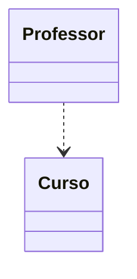
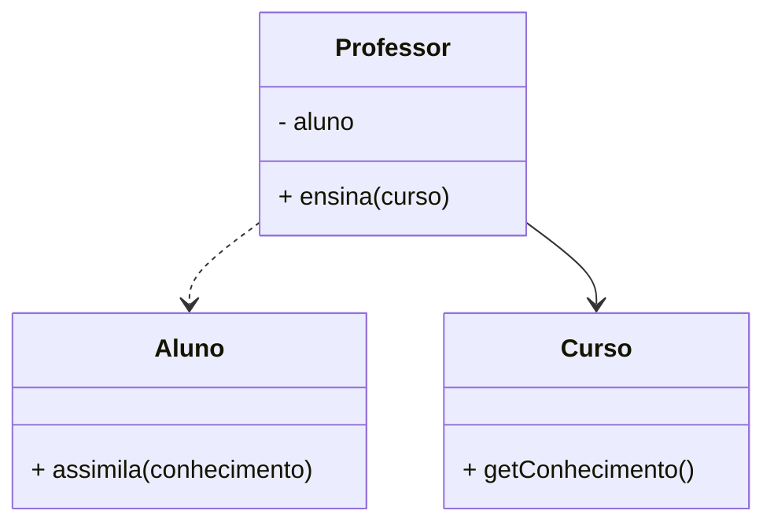
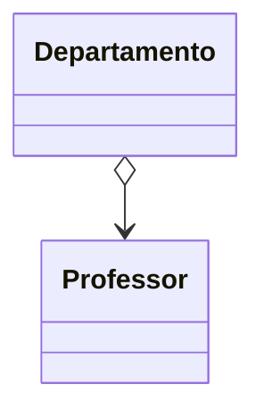
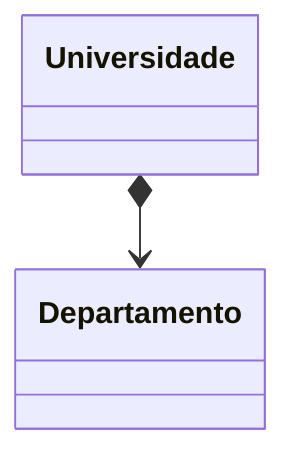
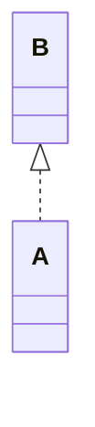
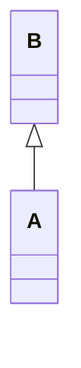
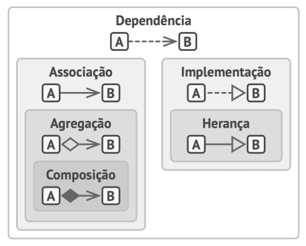

# Dependencia

Temos uma dependencia quando uma classe quando utilizamos classes concretas em nosso código; estas classes podem ser atributos ou até mesmo serem recebidas por um construtor ou passagem de parametros.

> A mudança no comportamento das classes relacionadas resulta em modificações em nosso código, tornando- dependente de membros externos.

# Associação

É um relacionamento onde um objeto usa ou interage com outro.

# Agregação

A agregação é um tipo especial de associação que representam associações 1:1, 1:N e N:N.

Utilizamos a definição **tem um** para tipificá-lo como um objeto que possui um e ele pode existir sem o container. 

# Composição

Composição é um tipo específico de agregação onde, o objeto é composto por instancias de outros objetos.
O componente da composição só pode existir como parte do container.

# Implementação

A implementação é quando uma classe torna concreta uma interface, uma interface é a declaração de comportamentos abstratos.

# Herança

A herança possibilita a criação de intefaces que possuem atributos, métodos concretos e a possibilidade de sobrescrita de comportamentos às classes filhas.

# Resumo geral dependencias

Tipo | Descrição
-- | --
*Dependencia* | Classe A pode ser afetada por mudanças na classe B
*Associação* | Objeto A sabe sobre objeto B. Classe A depende de B.
*Agregação* | Objeto A sabe sobre objeto B e consiste de B. Classe A depende de B.
*Composição* | Objeto A sabe sobre objeto B e consiste de B e gerencia o ciclo de vida de B. Classe A depende de B.
*Implementação* | A classe A define os comportamentos declarados classe B. Objetos A podem ser tratados como B. Classe A depende de B.
*Herança* | A classe A herda a interface e implementação de B mas pode extendê-la. Objetos de A podem ser tratados como B. Classe A depende de B.